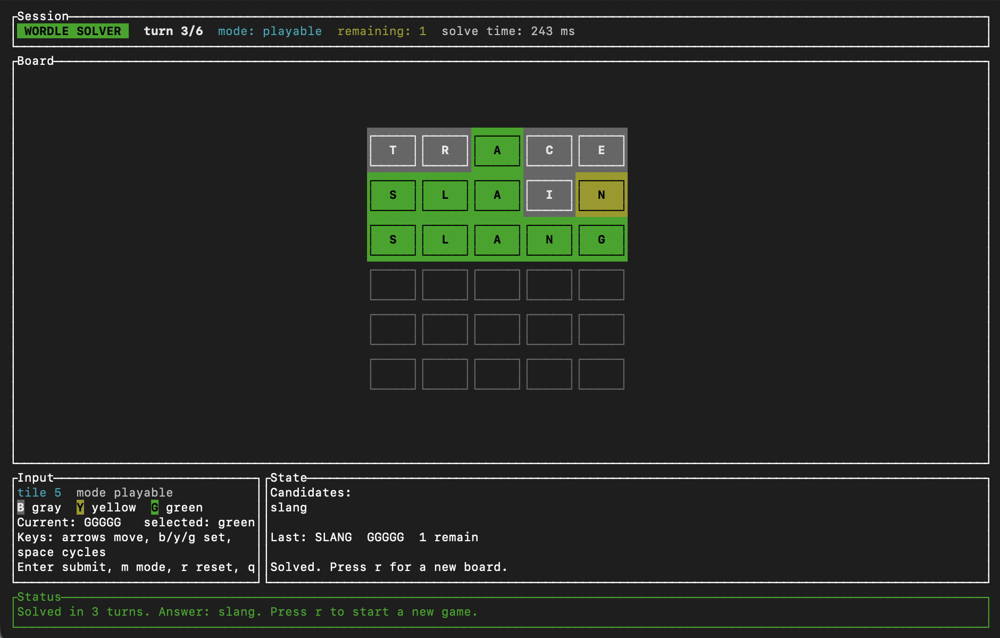

# Wordle Solver

This is a super fast Wordle solver. On a MacBook Pro (M4), it solves about
826,577 full Wordle games per second, which translates to about 1.21 microseconds
to solve a single Wordle game, with ~24,175 CPU cycles end-to-end.

## Usage

This repo bundles a TUI, use it with:

```sh
cargo run -p wordle_cli
```



## Library usage

The core solver also ships as a Rust crate. Add it as a workspace member or a
path dependency:

```toml
[dependencies]
wordle_solver = { path = "crates/wordle_solver" }
```

Then drive it row-by-row:

```rust
use wordle_solver::{Feedback, OfficialSolver, SolverStatus};

fn main() -> Result<(), Box<dyn std::error::Error>> {
    let mut solver = OfficialSolver::try_new()?;

    let first_guess = solver.next_guess();
    println!("guess: {first_guess}");

    let status = solver.apply_feedback(Feedback::parse("bbygb")?)?;
    match status {
        SolverStatus::InProgress => {
            println!("next: {}", solver.next_guess());
        }
        SolverStatus::Solved(word) => {
            println!("solved: {word}");
        }
    }

    Ok(())
}
```

The bundled corpus metadata is also exposed directly:

```rust
use wordle_solver::{bundled_answer_count, bundled_opening_guess};

fn main() -> Result<(), Box<dyn std::error::Error>> {
    println!("opening guess: {}", bundled_opening_guess()?);
    println!("answers: {}", bundled_answer_count()?);
    Ok(())
}
```

## About the bundled asset

The crate includes a bundled binary asset with the official-style Wordle corpus,
the full precomputed guess/answer feedback matrix, and a few precomputed policy
tables used to accelerate the early turns. It exists purely so the solver can
start instantly and stay fast at runtime.

Nothing is downloaded at runtime, and the solver does not make any network
requests. The asset is just static data compiled into the crate. (TL;DR not malware!)
